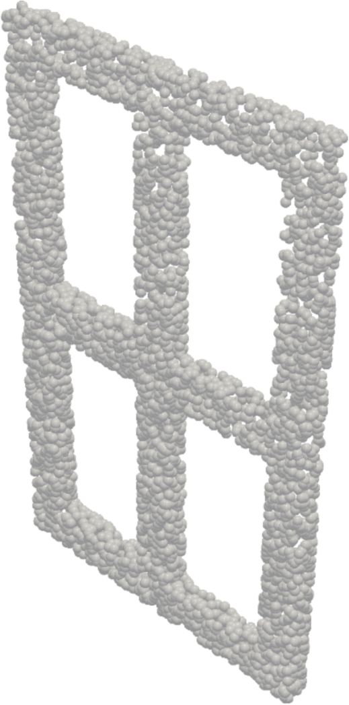
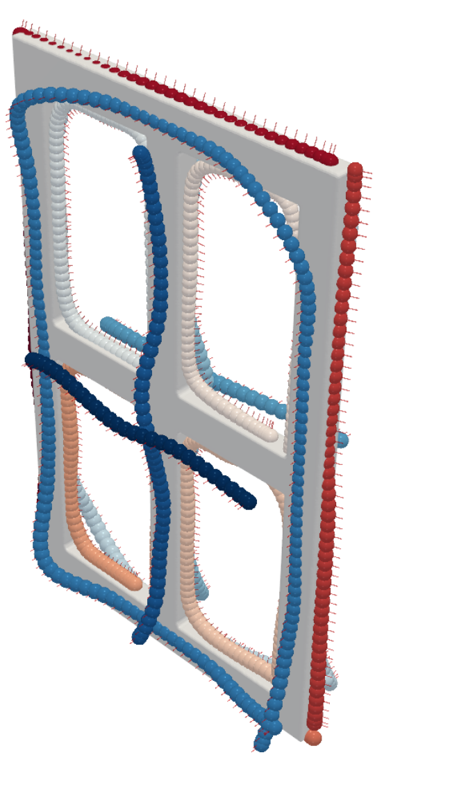
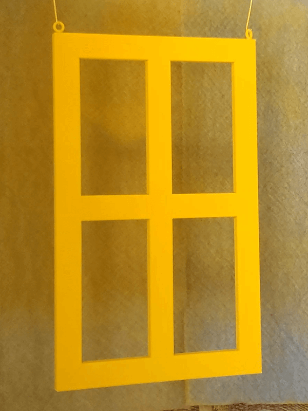

# MaskPlanner: Learning-Based Object-Centric Motion Generation from 3D Point Clouds

[Preprint]() / [Website](https://gabrieletiboni.github.io/maskplanner/) / [Dataset](https://zenodo.org/records/XXXXXXX)
<!-- [Video](https://gabrieletiboni.github.io/maskplanner/) -->

##### Gabriele Tiboni, Raffaello Camoriano, Tatiana Tommasi

*Abstract:* Object-Centric Motion Generation (OCMG) plays a key role in a variety of industrial applications—such as robotic spray painting and welding—requiring efficient, scalable, and generalizable algorithms to plan multiple long-horizon trajectories over free-form 3D objects. However, existing solutions rely on specialized heuristics, expensive optimization routines, or restrictive geometry assumptions that limit their adaptability to real-world scenarios. In this work, we introduce a novel, fully data-driven framework that tackles OCMG directly from 3D point clouds, learning to generalize expert path patterns across free-form surfaces. We propose MaskPlanner, a deep learning method that predicts local path segments for a given object while simultaneously inferring "path masks" to group these segments into distinct paths. This design induces the network to capture both local geometric patterns and global task requirements in a single forward pass. Extensive experimentation on a realistic robotic spray painting scenario shows that our approach attains near-complete coverage (above 99%) for unseen objects, while it remains task-agnostic and does not explicitly optimize for paint deposition. Moreover, our real-world validation on a 6-DoF specialized painting robot demonstrates that the generated trajectories are directly executable and yield expert-level painting quality. Our findings crucially highlight the potential of the proposed learning method for OCMG to reduce engineering overhead and seamlessly adapt to several industrial use cases.

<!---->
<table style="text-align: center;">
  <thead>
    <tr>
      <td style="font-size: smaller; font-weight: bold; text-align: center;" colspan="4"><em>Real-world experimental evaluation of MaskPlanner</em></td>
    </tr>
  </thead>
  <tr>
    <td></td>
    <td></td>
    <td></td>
    <td></td>
  </tr>
  <tr>
    <td>Input Point Cloud</td>
    <!-- <td>Fixed DR</td> -->
    <td>Inference</td>
    <td>Execution</td>
    <td>Final result</td>
  </tr>
</table>

Our release is **under construction**, you can track its progress below:

- [ ] Extended PaintNet dataset for public download
- [x] Code implementation
  - [x] Dataset loader
  - [x] Training and inference
  - [ ] Baselines
    - [ ] Path-wise
    - [ ] Autoregressive
    - [ ] Point-wise
  - [ ] Results visualization and rendering
- [ ] Pretrained models

## Installation

This repository is designed for flexible experimentation. Clone the repository and install all dependencies:

1.  **Dataset**
  1.1 Download Extended PaintNet Dataset from [gabrieletiboni.github.io/MaskPlanner/](https://gabrieletiboni.github.io/MaskPlanner/)
  1.2 `export PAINTNET_ROOT=<path/to/dataset/>`
2. **Clone repo and install basic dependencies:**
  ```bash
  git clone <this-repo>
  cd MaskPlanner
  pip install -r requirements.txt
  ```
3.  **Set up CUDA and PyTorch:**
  3.1 Set up a full CUDA toolkit installation (not just the pytorch runtime version), i.e. `nvcc --version` must be working.
  3.2 Install `pytorch` according to your CUDA version: https://pytorch.org/get-started/locally/
  3.3 Install `pytorch3d`: https://github.com/facebookresearch/pytorch3d/blob/main/INSTALL.md
  3.4. Pay attention to the compatibility among the above packages according to the installed versions. See below for the specific versions this code has been tested on.
4. **Build and install additional dependencies:**
  ```bash
  cd torch-nndistance
  python build.py install
  ```

#### Versioning 
This code has been tested on:
- python=3.7, nvcc=10.2, torch=1.9.0, pytorch3d=0.7.0
  - pytorch3d=0.7.0 was installed from source from Github: `pip install "git+https://github.com/facebookresearch/pytorch3d.git@v0.7.0"`
- python=3.8, nvcc=11.6, torch=1.13.1, pytorch3d=0.7.2
  - In this case, pytorch3d 0.7.2 could only be installed through the Anaconda cloud (`conda install pytorch3d -c pytorch3d`, or through the specific label `pytorch3d-0.7.2-py38_cu116_pyt1131.tar.bz2`)
- python=3.8, nvcc=12.1, torch=2.2.0, pytorch3d commit c292c71c1adb0712c12cf4fa67a7a84ad9b44e5c
    - pytorch3d installed from main branch on Github through command: `pip install "git+https://github.com/facebookresearch/pytorch3d.git"` (HEAD commit at the time of writing is: c292c71c1adb0712c12cf4fa67a7a84ad9b44e5c)


## Getting started
### Training

> ⚠️ *Coming Soon*

### Reproduce paper results
> ⚠️ *Coming Soon*

## Citation

<!--If you find this repository useful, please consider citing:-->
> ⚠️ *Coming Soon*


## Acknowledgments

We acknowledge the EFORT group for providing object mesh files, expert trajectory data, access to a proprietary spray painting simulator and to specialized painting robot hardware for the real-world experimental evaluation.
