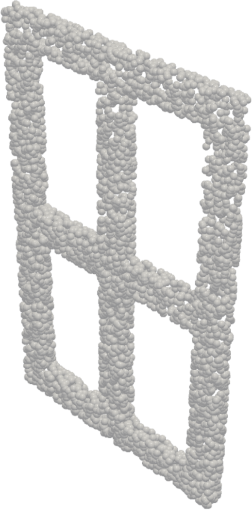
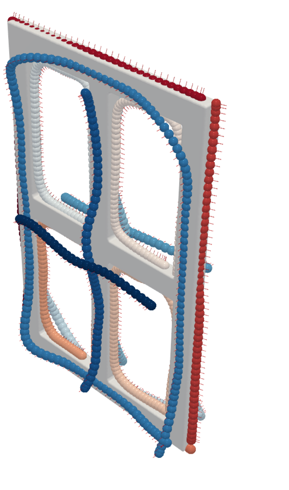
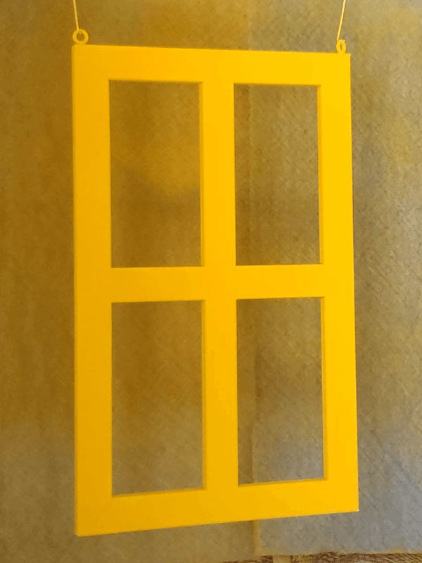

# MaskPlanner: a Framework for 3D Learning-Based Object-Centric Motion Generation and Applications to Robotic Spray Painting

[Paper](https://arxiv.org/abs/2502.18745) / [Website](https://gabrieletiboni.github.io/maskplanner/) / [Code](https://github.com/vandal-lab/MaskPlanner) / [Dataset](https://zenodo.org/records/14967945)
<!-- [Video](https://gabrieletiboni.github.io/maskplanner/) -->

##### Gabriele Tiboni, Raffaello Camoriano, Tatiana Tommasi

##### Accepted at IEEE Transactions on Robotics (T-RO).

*Abstract:* Object-Centric Motion Generation (OCMG) plays a key role in a variety of industrial applications—such as robotic spray painting and welding—requiring efficient, scalable, and generalizable algorithms to plan multiple long-horizon trajectories over free-form 3D objects. However, existing solutions rely on specialized heuristics, expensive optimization routines, or restrictive geometry assumptions that limit their adaptability to real-world scenarios. In this work, we introduce a novel, fully data-driven framework that tackles OCMG directly from 3D point clouds, learning to generalize expert path patterns across free-form surfaces. We propose MaskPlanner, a deep learning method that predicts local path segments for a given object while simultaneously inferring "path masks" to group these segments into distinct paths. This design induces the network to capture both local geometric patterns and global task requirements in a single forward pass. Extensive experimentation on a realistic robotic spray painting scenario shows that our approach attains near-complete coverage (above 99%) for unseen objects, while it remains task-agnostic and does not explicitly optimize for paint deposition. Moreover, our real-world validation on a 6-DoF specialized painting robot demonstrates that the generated paths are directly executable and yield expert-level painting quality. We additionally provide empirical evidence that our approach remains complementary to downstream trajectory optimization methods, and applicable to tasks beyond spray painting.

<!---->
<table style="text-align: center;">
  <thead>
    <tr>
      <td align="center" style="font-size: smaller; font-weight: bold; text-align: center;" colspan="4"><em>Real-world experimental evaluation of MaskPlanner</em></td>
    </tr>
  </thead>
  <tr>
    <td></td>
    <td></td>
    <td></td>
    <td></td>
  </tr>
  <tr>
    <td align="center">Input Point Cloud</td>
    <td align="center">Inference</td>
    <td align="center">Execution (x4)</td>
    <td align="center">Final result</td>
  </tr>
</table>

<table align="center" bgcolor="#E8EAF6" style="border: 2px solid #2196F3; border-radius: 8px; background-color: #E8EAF6; width: 100%;">
  <tr>
    <td style="padding: 16px;">
      <h3 style="margin: 0 0 6px 0;">&nbsp;&nbsp;The code has moved to a new repository</h3>
      <p style="margin: 0;">This repository only hosts the project website. The MaskPlanner training and inference code is now maintained at <a href="https://github.com/vandal-lab/MaskPlanner"><strong>github.com/vandal-lab/MaskPlanner</strong></a> — please head there for installation, training, and pretrained models.</p>
    </td>
  </tr>
</table>


## Citation

If you find this repository useful, please consider citing:
```
@misc{tiboni2025maskplanner,
      title={MaskPlanner: Learning-Based Object-Centric Motion Generation from 3D Point Clouds}, 
      author={Gabriele Tiboni and Raffaello Camoriano and Tatiana Tommasi},
      year={2025},
      eprint={2502.18745},
      archivePrefix={arXiv},
      primaryClass={cs.RO},
      url={https://arxiv.org/abs/2502.18745}, 
}
```


## Acknowledgments

This study was carried out within the FAIR - Future Artificial Intelligence Research and received funding from the European Union Next-GenerationEU (PIANO NAZIONALE DI RIPRESA E RESILIENZA (PNRR) – MISSIONE 4 COMPONENTE 2, INVESTIMENTO 1.3 – D.D. 1555 11/10/2022, PE00000013). This manuscript reflects only the authors' views and opinions; neither the European Union nor the European Commission can be considered responsible for them.

We also acknowledge the support of the European H2020 ELISE project ([www.elise-ai.eu](https://www.elise-ai.eu)) and the CINECA award under the ISCRA initiative (DRE-URL - HP10CF881L) for the availability of HPC resources and support.

This work was supported by the EFORT group, providing the authors with domain knowledge, original object meshes, trajectory data, and access to the proprietary spray painting simulator and hardware used during the experiments.
