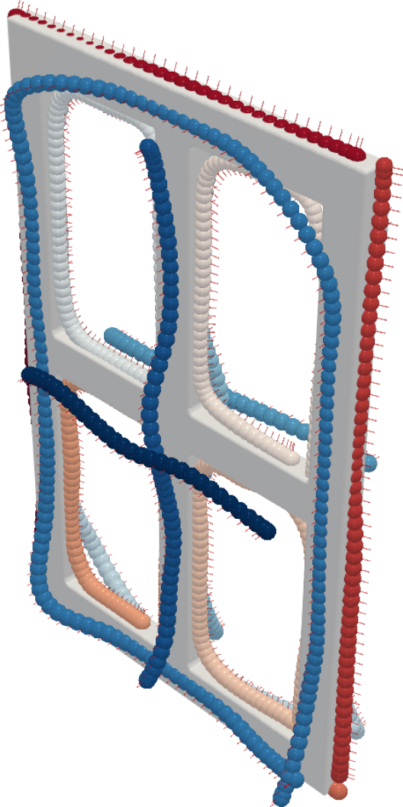

# MaskPlanner: Learning-Based Object-Centric Motion Generation from 3D Point Clouds

[Preprint](https://arxiv.org/abs/2502.18745) / [Website](https://gabrieletiboni.github.io/maskplanner/) / [Dataset](https://gabrieletiboni.github.io/maskplanner/)
<!-- [Video](https://gabrieletiboni.github.io/maskplanner/) -->

##### Gabriele Tiboni, Raffaello Camoriano, Tatiana Tommasi

##### Under review.

*Abstract:* Object-Centric Motion Generation (OCMG) plays a key role in a variety of industrial applications—such as robotic spray painting and welding—requiring efficient, scalable, and generalizable algorithms to plan multiple long-horizon trajectories over free-form 3D objects. However, existing solutions rely on specialized heuristics, expensive optimization routines, or restrictive geometry assumptions that limit their adaptability to real-world scenarios. In this work, we introduce a novel, fully data-driven framework that tackles OCMG directly from 3D point clouds, learning to generalize expert path patterns across free-form surfaces. We propose MaskPlanner, a deep learning method that predicts local path segments for a given object while simultaneously inferring "path masks" to group these segments into distinct paths. This design induces the network to capture both local geometric patterns and global task requirements in a single forward pass. Extensive experimentation on a realistic robotic spray painting scenario shows that our approach attains near-complete coverage (above 99%) for unseen objects, while it remains task-agnostic and does not explicitly optimize for paint deposition. Moreover, our real-world validation on a 6-DoF specialized painting robot demonstrates that the generated trajectories are directly executable and yield expert-level painting quality. Our findings crucially highlight the potential of the proposed learning method for OCMG to reduce engineering overhead and seamlessly adapt to several industrial use cases.

<!---->
<table style="text-align: center;">
  <thead>
    <tr>
      <td align="center" style="font-size: smaller; font-weight: bold; text-align: center;" colspan="4"><em>Real-world experimental evaluation of MaskPlanner</em></td>
    </tr>
  </thead>
  <tr>
    <td></td>
    <td></td>
    <td></td>
    <td></td>
  </tr>
  <tr>
    <td align="center">Input Point Cloud</td>
    <td align="center">Inference</td>
    <td align="center">Execution (x4)</td>
    <td align="center">Final result</td>
  </tr>
</table>

Our release is **under construction**, you can track its progress below:

- [ ] Extended PaintNet dataset for public download
- [ ] Code implementation
  - [x] Dataset loader
  - [x] Training and inference
  - [ ] Baselines
    - [ ] Path-wise
    - [ ] Autoregressive
    - [ ] Point-wise
  - [x] Results visualization and rendering
- [ ] Pretrained models


## Installation

This repository is designed for flexible experimentation. Clone the repository and install all dependencies:

1.  **Dataset**
    
    1.1 Download Extended PaintNet Dataset from [gabrieletiboni.github.io/MaskPlanner/](https://gabrieletiboni.github.io/MaskPlanner/)

    1.2 `export PAINTNET_ROOT=<path/to/dataset/>`

2. **Clone repo and install basic dependencies:**
    ```bash
    git clone <this-repo>
    cd MaskPlanner
    pip install -r requirements.txt
    ```

3.  **Set up CUDA and PyTorch:**

    3.1 Set up a full CUDA toolkit installation (not just the pytorch runtime version), i.e. the command `nvcc --version` must be working.

    3.2 Install `pytorch` according to your CUDA version: https://pytorch.org/get-started/locally/

    3.3 Install `pytorch3d`: https://github.com/facebookresearch/pytorch3d/blob/main/INSTALL.md

    3.4. Pay attention to the compatibility among the above packages according to the installed versions. See below for the specific versions this code has been tested on.


4. **(optional) Set up a custom working directory for the training runs and wandb login:**
    ```bash
    export WORKDIR=<root/to/runs/dir>

    # login to wandb if you want to log runs on wandb with: python [...] wandb=online
    ```


#### Versioning 
This code has been tested on:
- python=3.7, nvcc=10.2, torch=1.9.0, pytorch3d=0.7.0
  - pytorch3d=0.7.0 was installed from source from Github: `pip install "git+https://github.com/facebookresearch/pytorch3d.git@v0.7.0"`
- python=3.8, nvcc=11.6, torch=1.13.1, pytorch3d=0.7.2
  - In this case, pytorch3d 0.7.2 could only be installed through the Anaconda cloud (`conda install pytorch3d -c pytorch3d`, or through the specific label `pytorch3d-0.7.2-py38_cu116_pyt1131.tar.bz2`)
- python=3.8, nvcc=12.1, torch=2.2.0, pytorch3d commit c292c71c1adb0712c12cf4fa67a7a84ad9b44e5c
    - pytorch3d installed from main branch on Github through command: `pip install "git+https://github.com/facebookresearch/pytorch3d.git"` (HEAD commit at the time of writing is: c292c71c1adb0712c12cf4fa67a7a84ad9b44e5c)


## Getting started

### Training MaskPlanner
1. Quick debugging test (Cuboids)
    ```bash
    # Implicit, using `maskplanner` as an alias for multiple config files
    python train_maskplanner.py config=[maskplanner,cuboids_v2,longx_v2,debug] seed=42

    # Explicit, using the full list of config file names and some parameters explicitly. Equivalent to the above command.
    python train_maskplanner.py config=[asymm_chamfer_v9,delayMasksLoss,traj_sampling_v2,sched_v9,cuboids_v2,longx_v2] \
                                wandb=disabled  \
                                epochs=20 \
                                eval_freq=10 \
                                batch_size=2 \
                                debug=true \
                                no_save=true \
                                seed=42
    ```

2. Official (Cuboids)
    ```bash
    python train_maskplanner.py config=[maskplanner,cuboids_v2,longx_v2] seed=42
    ```

Config files defined in the `config=[...]` parameters can be found at `configs/maskplanner`. If a parameter appears in multiple config files, the order of the config files matter (later configs overwrite preceeding configs). A parameter may always be explicitly specified on the command line, talking ultimate priority (e.g. `seed=42`).
In the examples above, the config name `maskplanner` is an alias that includes multiple config files at the same time (i.e. `asymm_chamfer_v9,delayMasksLoss,traj_sampling_v2,sched_v9`). See aliases in `utils/args.py:config_aliases`.
See more examples at the top of `train_maskplanner.py`.


### Reproduce paper results
```bash
python train_maskplanner.py config=[maskplanner,cuboids_v2,longx_v2] seed=42
python train_maskplanner.py config=[maskplanner,windows_v2,longx_v2] seed=42
python train_maskplanner.py config=[maskplanner,shelves_v2,longx_v2] seed=42
python train_maskplanner.py config=[maskplanner,containers_v2,longx_v2] seed=42
```


## Citation

If you find this repository useful, please consider citing:
```
@misc{tiboni2025maskplanner,
      title={MaskPlanner: Learning-Based Object-Centric Motion Generation from 3D Point Clouds}, 
      author={Gabriele Tiboni and Raffaello Camoriano and Tatiana Tommasi},
      year={2025},
      eprint={2502.18745},
      archivePrefix={arXiv},
      primaryClass={cs.RO},
      url={https://arxiv.org/abs/2502.18745}, 
}
```


## Acknowledgments

We acknowledge the EFORT group for providing object mesh files, expert trajectory data, access to a proprietary spray painting simulator and to specialized painting robot hardware for the real-world experimental evaluation.
